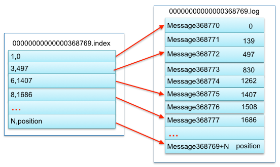
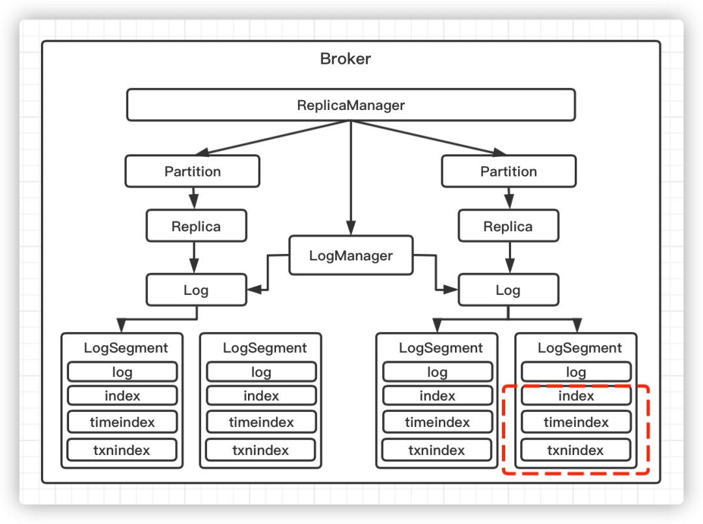

# Kafka 数据索引文件损坏


## Kafka 数据索引文件损坏

### 背景说明

Kafka 集群版本为 0.10.2.2。监控系统告警，显示 Kafka broker 节点 CPU、内存被打满。同时，业务报障 Kafka 集群生产消费速度受影响。

### 问题排查

#### Broker 日志

```Text
WARN Found a corrupted index file due to requirement failed: Corrupt index found, index file (/data/kafka-logs/monitor-2/00000000000024386649.index) has non-zero size but the last offset is 24386649 which is no larger than the base offset 24386649.}. deleting /data/kafka-logs/monitor-2/00000000000024386649.timeindex, /data/kafka-logs/monitor-2/00000000000024386649.index and rebuilding index... (kafka.log.Log)
WARN Found invalid messages in log segment /data/kafka-logs/monitor-2/00000000000024386649.log at byte offset 886339595: Record size is smaller than minimum record overhead (14).. (kafka.log.LogSegment)
INFO Recovering unflushed segment 24386649 in log monitor-2. (kafka.log.Log)
INFO Completed load of log monitor-2 with 1 log segments and log end offset 31119681 in 18507 ms (kafka.log.Log)
```

从 Broker 日志可确认，Kafka Broker 被非正常关闭停止，导致索引文件损坏。同时，查看系统日志（/var/log/messages）确认，由于内存打满，Kafka 进程被 OOM killer。

### 解决方案

从 Kafka broker 日志可以看到，索引文件正在重建（rebuilding index...），只需等着索引文件自动重建完成，服务即可恢复正常。

### 原理分析

#### 索引文件为什么会损坏？

##### 索引文件格式


- relativeOffset: 相对偏移量，表示消息相对于 baseOffset 的偏移量，占用 4 个字节（relativeOffset = offset - baseOffset），当前索引文件的文件名即为 baseOffset 的值。使用相对偏移量可以节省非常多的磁盘空间。如：一个 LogSegment 的 baseOffset 为 67，那么其文件名就是 00000000000000000067.log，offset=111 的消息在索引文件中的 relativeOffset 的值为 111-67=44。
- position: 物理地址，也就是消息在日志分段文件中对应的物理位置，占用 4 个字节。

索引文件与数据文件对应关系物理结构如下：



##### 索引文件损坏原因

Kafka 服务启动后，会校验索引文件的完整性。报错地方的源码（kafka/log/OffsetIndex.scala）如下：

```scala
/* the last offset in the index */
private[this] var _lastOffset = lastEntry.offset

...
/**
  * The last entry in the index
  */
private def lastEntry: OffsetPosition = {
  inLock(lock) {
    _entries match {
      case 0 => OffsetPosition(baseOffset, 0)
      case s => parseEntry(mmap, s - 1).asInstanceOf[OffsetPosition]
    }
  }
}
...

override def sanityCheck() {
    require(_entries == 0 || _lastOffset > baseOffset,
            s"Corrupt index found, index file (${file.getAbsolutePath}) has non-zero size but the last offset " +
                s"is ${_lastOffset} which is no larger than the base offset $baseOffset.")
    val len = file.length()
    require(len % entrySize == 0,
            "Index file " + file.getAbsolutePath + " is corrupt, found " + len +
            " bytes which is not positive or not a multiple of 8.")
  }
```

- \_entries：表示索引文件条目数
- \_lastOffset：如果 \_entries 为 0，即索引文件为空时，与 baseOffset；否则为最后一条索引绝对偏移量
- baseOffset：为索引文件基础偏移量，与文件名称一致
- entrySize：OffsetIndex（偏移量索引文件） 为 8 字节；TimeIndex（时间戳索引文件） 为 12 字节

从源码可知，有两个条件会导致索引文件损坏错误：

1. 索引文件条目数不为 0，且最后一条索引偏移量小于或等于基础偏移量
2. 索引文件数据量不为 8 的整数倍

最开始找到的 Broker 报错日志中有如下信息：

```txt
Corrupt index found, index file (/data/kafka-logs/monitor-2/00000000000024386649.index) has non-zero size but the last offset is 24386649 which is no larger than the base offset 24386649.}
```

从日志中可以看到，_lastOffset 与 baseOffset 一致，且都跟文件名相同。说明索引文件为空，导致最后一条索引偏移量不大于基础偏移量，从而报错。

索引文件使用 mmap、日志文件使用 Page Cache 技术提升读写性能，数据不会立即写入磁盘，依赖操作系统定时刷盘机制。所以在 Kafka 进程异常退出场景下（kill -9 或宕机），数据可能并未完整写入磁盘文件，文件末尾可能会有一些不合法的数据，或者数据完全未写入磁盘，导致索引文件为空。

#### 索引文件重建进度怎么确定？



Kafka Broker 节点上数据存储结构：Topic + Partition + Replica + LogSegment + Index。

每个 Partition 数据被划分成了多个 LogSegment，默认大小为 1GB，可通过参数 log.segment.bytes 修改。将整个 Partition 数据拆分为多个 LogSegment 的目的是为了防止单个 Log 日志过大，同时便于消息的查找、维护和清理，以及方便过期的 LogSegment 快速被删除。

每个 LogSegment 都会包含两个索引文件，分别是 .index 和 .timeindex，即位移索引文件和时间戳索引文件。当数据写入分区时，它会被写入一个 active LogSegment，一个 Partition 中同一时刻只会有一个 active LogSegment。如果该 active LogSegment 数据量达到最大的大小限制，则会滚动打开一个新 LogSegment，该 LogSegment 将成为新的 active LogSegment。每次滚动生成一个新 LogSegment 时，都会同时打开索引文件，两者成对出现。

基于上述说明，在 Kafka 进程异常退出场景下（kill -9 或宕机），通常一个 Partition 只会有最后一个 LogSegment 未被刷盘，或者在数据量比较大时会有多个。所以，我们可以通过 Kafka 服务日志大致推测出索引文件重建进度。

##### 查看索引文件重建进度

1. 查看 Broker 上 Partition 个数

    > /data/kafka-logs 目录下可能还包括几个 Kafka 状态文件，如 cleaner-offset-checkpoint 等，可手动减掉具体数量

    ```shell
    ll /data/kafka-logs | wc -l
    ```

2. 查找到第一条索引重建日志

    > 一般会在 "INFO Loading logs" 日志之后，开始重建索引。最近时间的一条日志即为开始时间日志。

    ```shell
    grep "INFO Loading logs" /data/kafka/logs/server.log
    ```

3. 查看已完成重建索引文件数量

    > 选择上一步骤最近时间的一条日志。

    ```shell
    grep -A1000000 "\[2023-08-02 19:12:09,880\] INFO Loading logs" /data/kafka/logs/server.log | grep ".index and rebuilding index" | wc -l
    ```

通过步骤 3 与步骤 1 数据结果进行比对，即可知道索引文件重建进度。同时，通过第 2 步查到的时间与当前时间比对，即可知道花费的时间，从而推断出剩余所需时间。

#### Kafka 优雅退出

要触发优雅关闭，需要向进程发送终止信号（例如类 Unix 系统中的 SIGTERM）。在 Kafka 脚本 kafka-server-stop.sh 中，停止 Kafka 进程使用如下脚本：

```shell
PIDS=$(ps ax | grep -i 'kafka\.Kafka' | grep java | grep -v grep | awk '{print $1}')

if [ -z "$PIDS" ]; then
  echo "No kafka server to stop"
  exit 1
else 
  kill -s TERM $PIDS
fi
```

`kill -s TERM` 即向 Kafka 进程发送一个 SIGTERM 信号。导致未优雅退出的场景一般为：机器异常关闭、OOM Killer、或手动执行 kill -9 等。同时，如果使用 systemd 管理 Kafka 进程，也有可能无法优雅退出。因为 systemd 允许进程优雅停止的默认超时时间为 90 秒，如果超时后进程还没有停止，它会使用 SIGKILL 强制终止进程。

Kafka 优雅关闭后，会在 ${log.dirs} 目录中生成 .kafka_cleanshutDown 文件，Kafka 在启动的时候，会检查是否存在该文件，从而判断是否要执行 recover log 操作。

优雅关闭时 Kafka 会将所有日志同步到磁盘，以避免在重新启动时需要进行任何日志恢复（即验证日志尾部所有消息的校验和）。日志恢复需要时间，因此这会加快有意重新启动的速度。同时，会将该 Broker 作为 leader 的所有分区 leader 迁移到其他副本，这将使 leader 转移更快，并将每个分区不可用的时间最小化到几毫秒。Kafka 官网对 Graceful shutdown 说明：[Graceful shutdown](https://kafka.apache.org/documentation/#basic_ops_restarting)。

