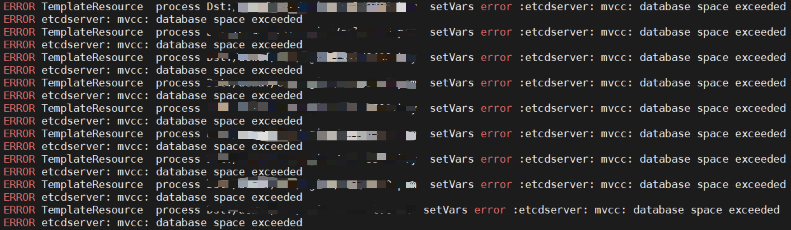
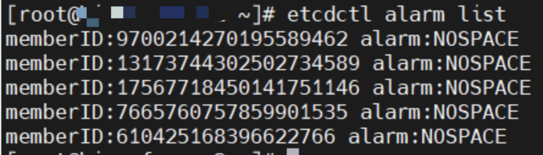
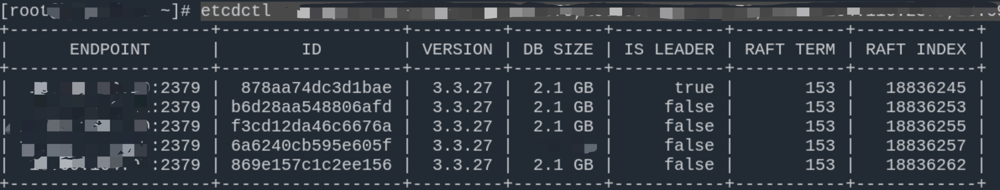
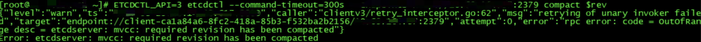
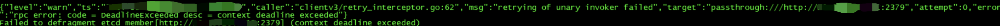
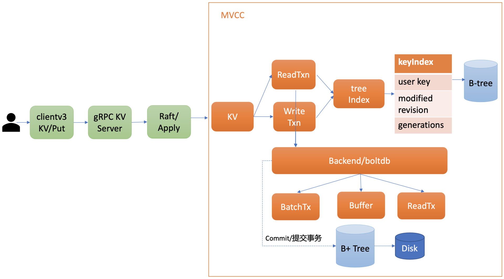

# etcd mvcc: database space exceeded


## etcd mvcc: database space exceeded

### 背景说明

系统通过 [confd](https://github.com/kelseyhightower/confd) + etcd 管理服务配置文件。新业务功能上线时发现新配置下发到 etcd 后，业务服务无法获取到最新配置。

经排查确认 etcd 异常，无法向 etcd 写入数据，仍然可以读取数据，报错信息：

```txt
ERROR TemplateResource process Dst: setVars error :etcdserver: mvcc: database space exceeded
```



### 问题排查

从客户端报错日志可知，etcd 数据库存储空间超出最大限制。默认存储大小限制为 2GB，可使用 `--quota-backend-bytes` 参数进行配置。官方建议最大大小为 8GB。本 etcd 集群启动时未修改数据库存储空间限制，所以默认只有 2GB。

- 确认警报已触发

```shell
ETCDCTL_API=3 etcdctl alarm list
```



- 确认 etcd 集群存储空间使用量

```shell
ETCDCTL_API=3 etcdctl endpoint status --cluster -w table
```



从 etcd 集群状态可以看出，各节点 `DB SIZE` 均以到达 2GB。

### 问题确认

如果数据库存储空间超出限制，则会引发 etcd 集群范围的警报，使集群进入维护模式，**仅接受键读取和删除**。只有在释放键足够存储空间并对数据库进行碎片整理，以及清除存储空间配额警报后，集群才能恢复正常运行。

### 解决方案

删除多余的键空间数据并对数据库进行碎片整理。

1. 数据备份（`在任一节点执行`）

    > 执行备份命令后，ETCD 将会创建一个快照文件，包含了当前集群的状态和数据。

    ```shell
    ETCDCTL_API=3 etcdctl snapshot save backup.db
    ETCDCTL_API=3 etcdctl snapshot status backup.db
    ```

2. 获取当前的版本（`在任一节点执行`）

    ```shell
    rev=$(ETCDCTL_API=3 etcdctl --endpoints=:2379 endpoint status --write-out="json" | egrep -o '"revision":[0-9]*' | egrep -o '[0-9].*')
    ```

3. 压缩掉所有旧版本（`在任一节点执行`）

    > 在任一节点上执行即可，如果多次执行会报错：etcdserver: mvcc: required revision has been compacted

    

    ```shell
    ETCDCTL_API=3 etcdctl compact $rev
    ```

4. 整理多余的碎片空间（`所有节点都执行`）

    > 集群中每个节点都需要执行。整理碎片空间时有可能会出现超时报错，主要是因为 etcdctl 工具默认的超时时间为 5s，而整理碎片会比较耗时，需要通过 --command-timeout 指定较长超时时间。defrag 时该节点处于不可用状态，如果此节点是 leader，且耗时超过 election timeout，则会触发超时选举。

    ```txt
    {"level":"warn","ts":"","logger":"etcd-client","caller":"v3/retry_interceptor.go:62","msg":"retrying of unary invoker failed","target":"etcd-endpoints://0xc0003541c0/127.0.0.1:2379","attempt":0,"error":"rpc error: code = DeadlineExceeded desc = context deadline exceeded"}
    Failed to defragment etcd member[127.0.0.1:2379] (context deadline exceeded)
    ```

    

    ```shell
    ETCDCTL_API=3 etcdctl --command-timeout=60s defrag
    ```

    或使用 --cluster 应用到集群所有节点（只需执行一次）

    ```shell
    ETCDCTL_API=3 etcdctl --command-timeout=60s defrag --cluster
    ```

5. 解除警报（`在任一节点执行`）

    ```shell
    ETCDCTL_API=3 etcdctl alarm disarm
    ```

### 优化方案

1. 增加 etcd 监控告警

    - etcd_server_quota_backend_bytes: etcd 的存储空间配额上限
    - etcd_mvcc_db_total_size_in_bytes: 数据库大小，包括等待碎片整理（defrag）的可用空间
    - etcd_mvcc_db_total_size_in_use_in_bytes: 有效数据实际使用大小

    etcd_mvcc_db_total_size_in_bytes 显著大于 etcd_mvcc_db_total_size_in_use_in_bytes，表明有大量的已删除或过期数据，这可能意味着碎片较多，建议进行碎片整理，监控告警表达式如下：

    ```PromQL
    (etcd_mvcc_db_total_size_in_bytes{}/etcd_mvcc_db_total_size_in_use_in_bytes{}) > 2
    ```

    数据库存储空间使用率监控告警表达式如下：

    ```PromQL
    (etcd_mvcc_db_total_size_in_bytes{}/etcd_server_quota_backend_bytes{}) * 100 > 80
    ```

2. 开启自动压缩

    - --auto-compaction-mode=periodic
    - --auto-compaction-retention=1

    周期性压缩，保留过去1个小时的历史版本。

### 原理分析

#### etcd 有效 key 很少，为什么数据库存储空间会超出配额？

MVCC（Multi-Version Concurrency Control），多版本并发控制。etcd 基于 MVCC 实现事务并发控制。MVCC 机制的核心思想是保存一个 key-value 数据的多个历史版本。在 MVCC 数据库中，更新一个 key-value 数据的时候，它并不会直接覆盖原数据，而是新增一个版本来存储新的数据，每个数据都有一个版本号，版本号为全局递增。随着对 key 的大量变更类操作，数据库也就会越来越大，直到达到数据库空间最大配额限制。数据不会自动清理，可以开启自动压缩机制定期清理历史版本数据。具体可参考下方“etcd 压缩机制”章节。

#### etcd mvcc 原理

etcd MVCC 模块主要由 treeIndex 和 Backend/boltdb 两部分组成。整体架构如下图所示：



Apply 模块通过 MVCC 模块来执行 put 请求，持久化 key-value 数据。MVCC 模块将请求请划分成两个类别，分别是读事务（ReadTxn）和写事务（WriteTxn）。读事务负责处理 range 请求，写事务负责 put/delete 操作。读写事务基于 treeIndex、Backend/boltdb 提供的能力，实现对 key-value 的增删改查功能。

treeIndex 模块基于内存版 B-Tree 实现键的索引管理，基于 Google 开源项目 btree 实现的一个索引模块，它保存了每一个 key 与对应的版本号（revision）的映射关系等信息。项目开源地址：<https://github.com/google/btree>。

Backend 在设计上支持多种存储的实现，目前的具体实现为 boltdb，boltdb 是一个基于 B+ 树的 KV 存储数据库。项目开源地址：<https://github.com/etcd-io/bbolt>。

#### etcd 为什么官方建议存储不超过 8GB？

1. 启动耗时

    etcd 启动的时候，需打开 boltdb db 文件，读取 db 文件所有 key-value 数据，用于重建内存 treeIndex 模块。因此在**大量 key** 导致 db 文件过大的场景中，这会导致 etcd 启动较慢。

2. 节点内存配置

    etcd 在启动的时候会通过 mmap 将 db 文件映射内存中，若节点可用内存不足，小于 db 文件大小时，可能会出现缺页文件中断，导致服务稳定性、性能下降。

3. treeIndex 索引性能

    内存中的 treeIndex 若保存了几十万到上千万的 key，会增加查询、修改操作的整体延时。

4. boltdb 性能

    大 db 文件场景会导致事务提交耗时增长、抖动。

5. 集群稳定性

    大 db 文件场景下，无论是百万级别小 key 还是上千个大 value 场景，一旦出现 expensive request 后，很容易导致 etcd OOM、节点带宽满而丢包。

6. 快照

    当 Follower 节点落后 Leader 较多数据的时候，会触发 Leader 生成快照重建发送给 Follower 节点，Follower 基于它进行还原重建操作。较大的 db 文件会导致 Leader 发送快照需要消耗较多的 CPU、网络带宽资源，同时 Follower 节点重建还原慢。

#### etcd 压缩机制

etcd 基于 MVCC 机制，数据存储多版本数据，随着写入的主键增加，历史版本也会增加，默认的历史数据是不会自动清理的。数据达到配额（默认2GB）后就不能写入，进入维护模式，必须要清理历史数据才能继续写入。etcd 支持通过 `--auto-compaction-retention` 参数开启自动压缩功能，清理历史版本数据。

压缩的本质是回收历史版本，目标对象仅是历史版本，不包括一个 key-value 数据的最新版本，不会删除最新版本数据。

etcd 支持通过参数 `--auto-compaction-mode` 指定压缩方式，有两种压缩方式：

- periodic: 时间周期性压缩模式
- revision: 版本号压缩模式

##### 时间周期性压缩模式

时间周期性压缩模式下，`--auto-compaction-retention=10` 表示保留的时间周期为10小时，首先等待10小时后第一次压缩，之后，每小时（10 小时的 1/10）进行一次压缩，压缩的 rev 为 1/10 间隔时间检测到的 rev 值，始终会保留过去 10 个小时的历史版本。如下：

```txt
0hr  (rev = 1)
1hr  (rev = 10)
...
8hr  (rev = 80)
9hr  (rev = 90)
10hr (rev = 100, Compact(1))
11hr (rev = 110, Compact(10))
...
```

- 第 0 小时到第 9 小时，均为执行压缩操作
- 第 10 小时，开始执行压缩，压缩的 rev 为 1，即最开始（0hr）的 rev 值
- 之后每个 1/10 间隔执行压缩，即第 11 小时继续执行压缩，压缩的 rev 为 10，即第 1 小时的 rev 值

##### 版本号压缩模式

版本号压缩模式下，`--auto-compaction-retention=10000` 表示保留的历史版本号数为10000，每隔5分钟定时获取当前 server 的最大版本号，减去你想保留的历史版本数（10000），然后执行压缩操作。如当前最大版本号为 30000，则压缩的 rev 值为 30000-10000=20000。

当写请求比较多，大量产生历史版本时，可以考虑版本号压缩模式。

