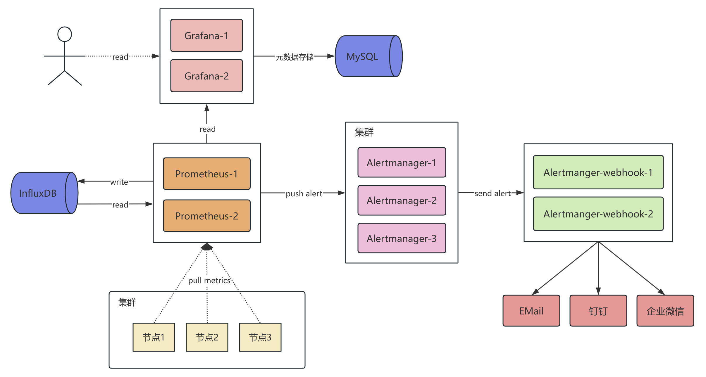
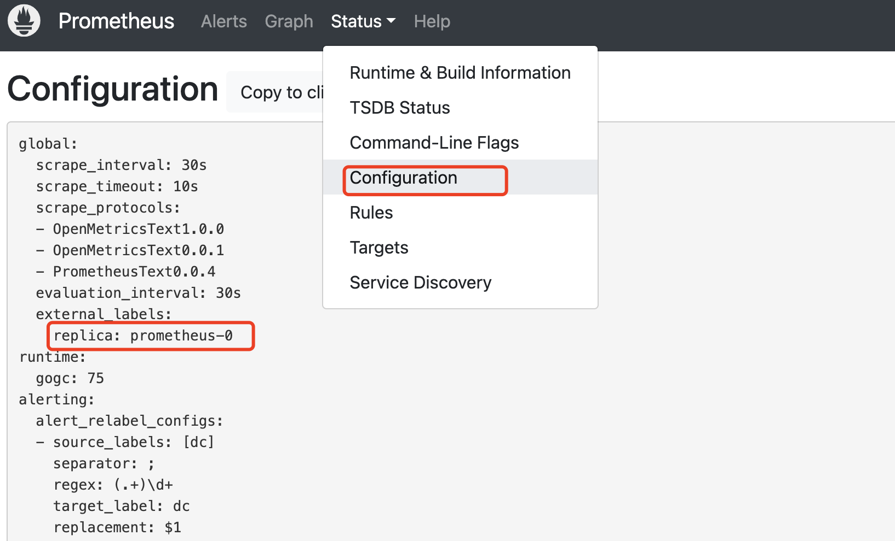
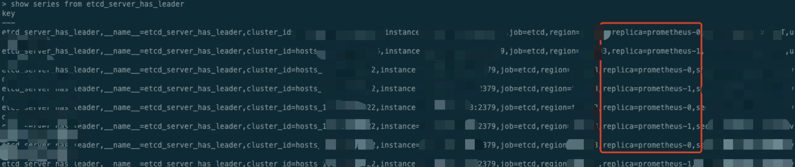

# 基于 K8s 实现 Prometheus 高可用架构方案


## 基于 K8s 实现 Prometheus 高可用架构方案

### 背景说明

没有监控告警平台的业务就相当于是在裸跑，本文将提供一套当前比较流行的高可用监控告警平台解决方案。

### 架构方案



1. 多个 Prometheus 服务从集群节点采集监控数据，并推送到 InfluxDB。
2. Prometheus 评估告警规则，并将告警推送到 Alertmanager。
3. Alertmanager 将告警信息推送到 Alertmanager-webhook，Alertmanager-webhook 是单独实现的一个 HTTP 服务，用于接收 Alertmanager 推送的告警信息，然后根据使用场景分别发送到邮箱、钉钉、企业微信等。
4. 用户通过 Grafana 查看监控图表。

### 部署

#### InfluxDB

##### InfluxDB v2 vs v1

1. InfluxDB v2 与 v1 存在较大差异，性能相对 v1 会有所提升，且 v2 与 v1 基础概念也有所变化。
2. v2 不支持 [Prometheus remote storage API](https://prometheus.io/docs/operating/integrations/#remote-endpoints-and-storage)，需要使用 Telegraf 作为中转组件，参考：[Prometheus Remote Write Support with InfluxDB 2.0](https://www.influxdata.com/blog/prometheus-remote-write-support-with-influxdb-2-0/)。同时，增加 Telegraf 会引入维护成本，所以选择 v1 版本作为 Prometheus 后端存储。
3. InfluxDB v1 [Prometheus remote storage API](https://prometheus.io/docs/operating/integrations/#remote-endpoints-and-storage) 支持文档参考：[Prometheus endpoints support in InfluxDB](https://docs.influxdata.com/influxdb/v1/supported_protocols/prometheus/)。

##### InfluxDB K8s yaml 部署文件

- 注意修改下面 yaml 文件中参数：
  - ${NAMESPACE}：K8s ns
  - ${STORAGE_INFLUXDB_SIZE}：PVC 存储大小
  - ${STORAGE_CLASS_NAME}：PVC 存储名称

```yaml
apiVersion: apps/v1
kind: Deployment
metadata:
  name: influxdb
  namespace: ${NAMESPACE}
spec:
  replicas: 1
  selector:
    matchLabels:
      app: influxdb
  strategy:
    type: Recreate
  template:
    metadata:
      labels:
        app: influxdb
    spec:
      containers:
        - image: influxdb:1.8.10
          imagePullPolicy: IfNotPresent
          resources:
            requests:
              memory: "32Mi"
              cpu: "1m"
            limits:
              memory: "16Gi"
              cpu: 4
          env:
            - name: INFLUXDB_CONFIG_PATH
              value: "/etc/influxdb/influxdb.conf"
            - name: INFLUXDB_ADMIN_ENABLED
              value: "true"
            - name: INFLUXDB_DB
              value: "prometheus"
          name: influxdb
          ports:
            - containerPort: 8086
              protocol: TCP
          volumeMounts:
            - name: influxdb-data-volume
              mountPath: /var/lib/influxdb
            - name: influxdb-config-volume
              mountPath: /etc/influxdb
      volumes:
        - name: influxdb-data-volume
          persistentVolumeClaim:
            claimName: influxdb-data
        - name: influxdb-config-volume
          configMap:
            name: influxdb-config
      imagePullSecrets:
        - name: pull-secret

---

apiVersion: v1
kind: ConfigMap
metadata:
  name: influxdb-config
  namespace: ${NAMESPACE}
data:
  influxdb.conf: |
    [meta]
      dir = "/var/lib/influxdb/meta"
    [data]
      dir = "/var/lib/influxdb/data"
      wal-dir = "/var/lib/influxdb/wal"
      wal-fsync-delay = "100ms"
      index-version = "tsi1"
      engine = "tsm1"
      cache-max-memory-size = "8g"
      cache-snapshot-memory-size = "200m"
      max-concurrent-compactions = 12
      compact-throughput = "64m"
      compact-throughput-burst = "64m"
      max-series-per-database = 0
      max-values-per-tag = 0
      series-id-set-cache-size = 100
    [monitor]
      store-enabled = false

---

apiVersion: v1
kind: PersistentVolumeClaim
metadata:
  name: influxdb-data
spec:
  accessModes:
    - ReadWriteOnce
  resources:
    requests:
      storage: ${STORAGE_INFLUXDB_SIZE}
  storageClassName: ${STORAGE_CLASS_NAME}

---

apiVersion: v1
kind: Service
metadata:
  name: influxdb
  namespace: ${NAMESPACE}
spec:
  ports:
    - port: 8086
      protocol: TCP
      targetPort: 8086
  selector:
    app: influxdb
  type: ClusterIP
```

#### Prometheus

##### Prometheus 高可用方案实现

1. Prometheus 官方社区并无高可用架构方案，Prometheus 均为单点部署。
2. Prometheus 也提供联邦集群架构，可以实现无限扩展、统一管理，提升集群性能，但同样也存在单点问题，无法满足要求。
3. Prometheus v2.32.0 提供 [Agent](https://prometheus.io/blog/#prometheus-agent-mode) 模式，可以直接将数据存储到远端，如 Thanos、InfluxDB 等，但该模式同样会禁用查询、告警功能，无法满足我们的要求。

业界一般会采用搭建多套 Prometheus，上层使用负载均衡的方式实现监控高可用，本文也会采用该方式。

###### 怎么区分多个 Prometheus 副本的数据呢？

当我们在 K8s 上启动多个 Prometheus 副本后，每个副本会并行采集所有 Target 监控数据，并统一推送的 InfluxDB 存储。其中会存在一个问题，即不同的 Prometheus 副本怎么区分 InfluxDB 中的哪些数据是它采集的呢？

Prometheus 提供了 external_labels 功能，全局的 external label, 当 Prometheus (Federation, Remote storage, Alertmanager) 和外部交互的时候很有用。举个例子：当多个 Prometheus 数据聚合到同一个 Federation Prometheus 或者 Remote storage 的时候，可以加一个 id/cluster/replica label 作为区分，如：

```yaml
global:
  external_labels:
    replica: A # B for the second replica.
```

但是，发送到 Alertmanager 的所有警报也将具有不同的副本标签。由于 Alertmanager 根据相同的标签集对警报进行重复数据删除，因此这种重复数据删除现在会失效。将会收到与 Prometheus 服务器副本一样多的告警通知。为解决这种问题，Prometheus 也提供了 alerting alert_relabel_configs 配置用于删除标签，如：

```yaml
alerting:
  alert_relabel_configs:
    # Drop the "replica" label.
    - action: labeldrop
      regex: replica
```

##### Prometheus K8s yaml 部署文件

K8s 中实现 Prometheus 上述逻辑，需要通过增加参数 --enable-feature=expand-external-labels 开启 external-labels 功能，然后基于 K8s StatefulSet pod 名称有序性，将 pod 名称作为 Prometheus external_labels replica，以实现数据区分。

- 注意修改下面 yaml 文件中参数：
  - ${NAMESPACE}：K8s ns
  - ${STORAGE_CLASS_NAME}：PVC 存储名称

```yaml
apiVersion: apps/v1
kind: StatefulSet
metadata:
  name: prometheus
  namespace: ${NAMESPACE}
spec:
  replicas: 2
  serviceName: prometheus
  selector:
    matchLabels:
      app: prometheus
  template:
    metadata:
      labels:
        app: prometheus
    spec:
      containers:
        - args:
            - --config.file=/etc/prometheus/config/prometheus.yaml
            - --storage.tsdb.path=/data/prometheus
            - --storage.tsdb.retention.time=3d
            - --web.enable-lifecycle
            - --enable-feature=expand-external-labels
          image: prom/prometheus:v2.54.1
          imagePullPolicy: IfNotPresent
          resources:
            requests:
              memory: "32Mi"
              cpu: "1m"
            limits:
              memory: "16Gi"
              cpu: 4
          env:
            - name: POD_NAME
              valueFrom:
                fieldRef:
                  fieldPath: metadata.name
          livenessProbe:
            failureThreshold: 3
            httpGet:
              path: /-/healthy
              port: 9090
              scheme: HTTP
            initialDelaySeconds: 30
            periodSeconds: 10
            successThreshold: 1
            timeoutSeconds: 30
          name: prometheus
          ports:
            - containerPort: 9090
              protocol: TCP
          readinessProbe:
            failureThreshold: 3
            httpGet:
              path: /-/ready
              port: 9090
              scheme: HTTP
            initialDelaySeconds: 30
            periodSeconds: 10
            successThreshold: 1
            timeoutSeconds: 30
          volumeMounts:
            - name: prometheus-config-volume
              mountPath: /etc/prometheus/config
            - name: prometheus-sd-configs-volume
              mountPath: /etc/prometheus/sd_configs
            - name: prometheus-rules-volume
              mountPath: /etc/prometheus/rules
            - name: prometheus-data-volume
              mountPath: /data/prometheus
      volumes:
        - name: prometheus-config-volume
          configMap:
            name: prometheus-config
        - name: prometheus-sd-configs-volume
          configMap:
            name: prometheus-sd-configs
        - name: prometheus-rules-volume
          configMap:
            name: prometheus-rules
      imagePullSecrets:
        - name: pull-secret
  volumeClaimTemplates:
    - metadata:
        name: prometheus-data-volume
      spec:
        accessModes:
          - ReadWriteOnce
        volumeMode: Filesystem
        storageClassName: ${STORAGE_CLASS_NAME}
        resources:
          requests:
            storage: 100Gi

---

apiVersion: v1
kind: ConfigMap
metadata:
  name: prometheus-config
  namespace: ${NAMESPACE}
data:
  prometheus.yaml: |
    global:
      scrape_interval: 30s
      scrape_timeout: 10s
      evaluation_interval: 30s

      external_labels:
        replica: ${POD_NAME}
    
    scrape_configs:
      - job_name: 'etcd'
        metrics_path: /metrics
        file_sd_configs:
          - files: ['/etc/prometheus/sd_configs/*.yml']
    
    alerting:
      alert_relabel_configs:
        - source_labels: [dc]
          regex: (.+)\d+
          target_label: dc
        - action: labeldrop
          regex: replica
      alertmanagers:
        - static_configs:
            - targets:
                - 'alertmanager-0.alertmanager.${NAMESPACE}.svc.cluster.local:9093'
                - 'alertmanager-1.alertmanager.${NAMESPACE}.svc.cluster.local:9093'
                - 'alertmanager-2.alertmanager.${NAMESPACE}.svc.cluster.local:9093'

    rule_files:
      - /etc/prometheus/rules/*.yml

    remote_write:
      - url: "http://influxdb:8086/api/v1/prom/write?db=prometheus"

    remote_read:
      - url: "http://influxdb:8086/api/v1/prom/read?db=prometheus"

---

apiVersion: v1
kind: Service
metadata:
  name: prometheus
  namespace: ${NAMESPACE}
spec:
  ports:
    - name: http
      port: 9090
      protocol: TCP
      targetPort: 9090
  selector:
    app: prometheus
  type: ClusterIP
  clusterIP: None

---

apiVersion: v1
kind: ConfigMap
metadata:
  name: prometheus-rules
data:
  etcd.rules.yml: |
    groups:
    - name: etcd
      rules:
      - alert: EtcdMembersDown
        expr: up{instance =~ ".*:2379"} == 0
        for: 1m
        labels:
          severity: critical
        annotations:
          summary: "Etcd member is down"
          description: "etcd cluster member [{{ $labels.instance }}] is down.\n  Labels: {{ $labels }}"

---

apiVersion: v1
kind: ConfigMap
metadata:
  name: prometheus-sd-configs
data:
  etcd1.yml: |
    - targets:
        - '10.0.0.1:2379'
        - '10.0.0.2:2379'
        - '10.0.0.3:2379'
      labels:
        cluster_id: "etcd1"
```

##### 校验 external_labels 是否生效

- 查看 Prometheus 控制台



- InfluxDB 数据验证



#### Alertmanager

Alertmanager 部署为集群版，三节点实现高可用。Alertmanager 会将告警分组聚合后发送到 webhook，webhook 对接了企业微信机器人，可以将告警信息推送到企业微信群。

- 注意修改下面 yaml 文件中参数：
  - ${NAMESPACE}：K8s ns
  - ${STORAGE_CLASS_NAME}：PVC 存储名称
  - ${ALERTMANAGER_WEBHOOK_CONFIGS_URL}：Alertmanager-webhook 服务地址

```yaml
apiVersion: apps/v1
kind: StatefulSet
metadata:
  labels:
    app: alertmanager
  name: alertmanager
  namespace: ${NAMESPACE}
spec:
  replicas: 3
  serviceName: alertmanager
  selector:
    matchLabels:
      app: alertmanager
  template:
    metadata:
      labels:
        app: alertmanager
    spec:
      containers:
        - name: alertmanager
          env:
            - name: POD_IP
              valueFrom:
                fieldRef:
                  fieldPath: status.podIP
          args:
            - "--log.level=info"
            - "--config.file=/etc/alertmanager/alertmanager.yml"
            - "--storage.path=/alertmanager"
            - "--cluster.settle-timeout=1m"
            - "--cluster.peer=alertmanager-0.alertmanager.${NAMESPACE}.svc.cluster.local:9094"
            - "--cluster.peer=alertmanager-1.alertmanager.${NAMESPACE}.svc.cluster.local:9094"
            - "--cluster.peer=alertmanager-2.alertmanager.${NAMESPACE}.svc.cluster.local:9094"
            - "--cluster.advertise-address=[$(POD_IP)]:9094"
            - "--cluster.listen-address=0.0.0.0:9094"
          image: prom/alertmanager:v0.27.0
          resources:
            requests:
              memory: "32Mi"
              cpu: "1m"
            limits:
              memory: "16Gi"
              cpu: 4
          ports:
            - containerPort: 9093
              name: alertmanager
          volumeMounts:
            - name: alertmanager-config-volume
              mountPath: /etc/alertmanager
            - name: alertmanager-data-volume
              mountPath: /alertmanager
      volumes:
        - name: alertmanager-config-volume
          configMap:
            name: alertmanager-config
      imagePullSecrets:
        - name: pull-secret
  volumeClaimTemplates:
    - metadata:
        name: alertmanager-data-volume
      spec:
        accessModes:
          - ReadWriteOnce
        storageClassName: ${STORAGE_CLASS_NAME}
        resources:
          requests:
            storage: 10Gi

---

apiVersion: v1
kind: ConfigMap
metadata:
  name: alertmanager-config
  namespace: ${NAMESPACE}
data:
  alertmanager.yml: |
    global:
      resolve_timeout: 5m

    route:
      receiver: default
      group_by: ["alertname", "cluster_id"]
      group_wait: 30s
      group_interval: 5m
      repeat_interval: 3h

      routes:
        - receiver: wechatrobot
          match:
            severity: critical

    receivers:
      - name: "default"
        webhook_configs:
          - send_resolved: true
            url: "${ALERTMANAGER_WEBHOOK_CONFIGS_URL}"

      - name: "wechatrobot"
        webhook_configs:
          - send_resolved: true
            url: "${ALERTMANAGER_WEBHOOK_CONFIGS_URL}"

---

apiVersion: v1
kind: Service
metadata:
  name: alertmanager
  namespace: ${NAMESPACE}
spec:
  ports:
    - name: http
      port: 9093
      targetPort: 9093
    - name: cluster
      port: 9094
      targetPort: 9094
  selector:
    app: alertmanager
  type: ClusterIP
  # headless service
  clusterIP: None
```

#### Alertmanager-webhook

本教材会对接到企业微信，参考开源实现：<https://github.com/k8stech/alertmanager-wechatrobot-webhook>。同时，也可将告警发送到钉钉，参考实现：<https://github.com/timonwong/prometheus-webhook-dingtalk>。

- 注意修改下面 yaml 文件中参数：
  - ${NAMESPACE}：K8s ns
  - ${DOCKER_IMAGE}：Docker 镜像，可参考代码仓库构建镜像

```yaml
apiVersion: apps/v1
kind: Deployment
metadata:
  labels:
    app: alertmanager-webhook
  name: alertmanager-webhook
  namespace: ${NAMESPACE}
spec:
  replicas: 2
  selector:
    matchLabels:
      app: alertmanager-webhook
  template:
    metadata:
      labels:
        app: alertmanager-webhook
    spec:
      containers:
        - name: alertmanager-webhook
          image: ${DOCKER_IMAGE}
          resources:
            requests:
              memory: "32Mi"
              cpu: "1m"
            limits:
              memory: "4Gi"
              cpu: 2
          ports:
            - containerPort: 8999
              name: http
      imagePullSecrets:
        - name: pull-secret

---

apiVersion: v1
kind: Service
metadata:
  name: alertmanager-webhook
  namespace: ${NAMESPACE}
spec:
  ports:
    - name: alertmanager-webhook
      port: 8999
      targetPort: 8999
  selector:
    app: alertmanager-webhook
  type: ClusterIP
```

#### Grafana

Grafana 社区支持单机版和集群版，单机版可直接使用内置的 SQLite 3 数据库，存储元数据信息。集群版则必须使用 MySQL 或 PostgreSQL 数据库。参考官方说明：<https://grafana.com/docs/grafana/latest/setup-grafana/installation/#supported-databases>。

单机版部署比较简单，本文使用单机版部署。

- 注意修改下面 yaml 文件中参数：
  - ${NAMESPACE}：K8s ns
  - ${STORAGE_CLASS_NAME}：PVC 存储名称
  - ${PROMETHEUS_URL}：Prometheus 访问地址，如：<http://prometheus:9090>
  - etcd_dashboard.json 配置，可直接去 Grafana 官网下载指定产品配置，如 etcd 配置下载地址：<https://grafana.com/grafana/dashboards/15308-etcd-cluster-overview/>

```yaml
apiVersion: apps/v1
kind: StatefulSet
metadata:
  name: grafana
spec:
  selector:
    matchLabels:
      app: grafana
  replicas: 1
  serviceName: grafana
  template:
    metadata:
      labels:
        app: grafana
    spec:
      containers:
      - name: grafana
        image: grafana/grafana:11.2.0
        resources:
          requests:
            memory: "128Mi"
            cpu: "10m"
          limits:
            memory: "8Gi"
            cpu: "4"
        args:
          - -config=/etc/grafana/grafana.ini
        ports:
          - containerPort: 3000
        volumeMounts:
          - name: grafana-data-volume
            mountPath: /var/lib/grafana
          - name: grafana-config-volume
            mountPath: /etc/grafana
          - name: grafana-datasources-volume
            mountPath: /etc/grafana/provisioning/datasources
          - name: grafana-dashboards-volume
            mountPath: /etc/grafana/provisioning/dashboards
      volumes:
        - name: grafana-config-volume
          configMap:
            name: grafana-config
        - name: grafana-datasources-volume
          configMap:
            name: grafana-datasources
        - name: grafana-dashboards-volume
          configMap:
            name: grafana-dashboards
      imagePullSecrets:
        - name: pull-secret
  volumeClaimTemplates:
    - metadata:
        name: grafana-data-volume
      spec:
        accessModes:
          - ReadWriteOnce
        volumeMode: Filesystem
        storageClassName: ${STORAGE_CLASS_NAME}
        resources:
          requests:
            storage: 10Gi

---

apiVersion: v1
kind: ConfigMap
metadata:
  labels:
    app: grafana-config
  name: grafana-config
data:
  grafana.ini: |
    [database]
    type = sqlite3

    [paths]
    provisioning = /etc/grafana/provisioning

    [auth.anonymous]
    enabled = true
    org_role = Viewer

    [analytics]
    reporting_enabled = false
    check_for_updates = false

    [dashboards]
    versions_to_keep = 20

    [alerting]
    enabled = false

---

apiVersion: v1
kind: ConfigMap
metadata:
  labels:
    app: grafana-datasources
  name: grafana-datasources
data:
  datasources.yml: |
    apiVersion: 1

    datasources:
    - name: Prometheus
      type: prometheus
      access: proxy
      url: ${PROMETHEUS_URL}
      isDefault: true
      version: 1
      editable: false

---

apiVersion: v1
kind: Service
metadata:
  name: grafana
  labels:
    app: grafana
spec:
  selector:
    app: grafana
  ports:
  - port: 3000
    targetPort: 3000
    protocol: TCP
  type: ClusterIP

---

apiVersion: v1
kind: ConfigMap
metadata:
  labels:
    app: grafana-dashboards
  name: grafana-dashboards
data:
  dashboard.yaml: |
    apiVersion: 1

    providers:
    - name: 'default'
      type: file
      disableDeletion: false
      updateIntervalSeconds: 3 #how often Grafana will scan for changed dashboards
      options:
        path: /etc/grafana/provisioning/dashboards

  etcd_dashboard.json: | 
    {
      ...
    }
```

