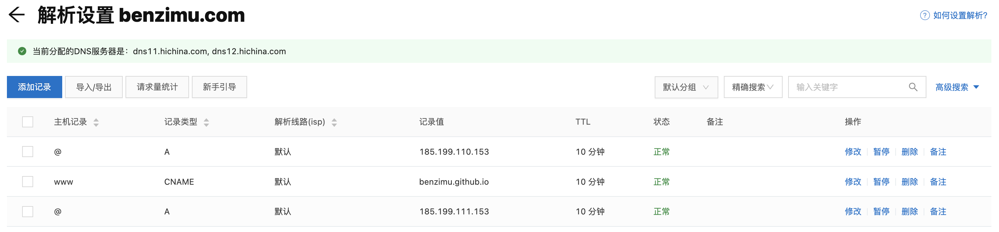
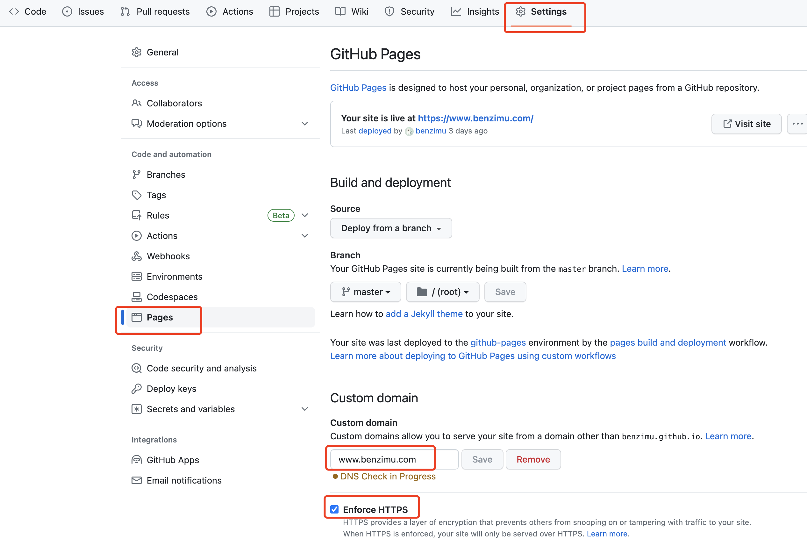

# Hugo + Github Pages 搭建个人博客


## Hugo + Github Pages  搭建个人博客

### 环境安装

#### 安装 Hugo

> 官方安装说明：[https://gohugo.io/installation/](https://gohugo.io/installation/)

```bash
brew install hugo
```

#### 初始化博客项目仓库

```bash
hugo new site mblog
cd mblog
git init
```

#### 配置 Hugo 主题

Hugo 博客框架有很多开源的主题，官方列表：[https://themes.gohugo.io/](https://themes.gohugo.io/)

1. 以 [LoveIt](https://themes.gohugo.io/themes/loveit/) 为例，安装主题：

    ```bash
    # 进入项目根目录
    cd mblog

    # 安装主题
    git submodule add https://github.com/dillonzq/LoveIt.git themes/LoveIt
    ```

2. 修改项目根目录下配置文件 `config.toml`，修改 `theme` 配置，如：

    ```yaml
    theme = "LoveIt"
    ```

#### 添加一篇文章

```bash
hugo new posts/first_post.md
```

新建一篇名为 `first_post.md` 的文章，存放在 `mblog/content/posts`。之后可以使用 Markdown 编辑器直接修改 `first_post.md`。

#### 本地启动服务预览

```bash
hugo server -D
```

服务启动后，浏览器访问 `http://localhost:1313/`，查看网站效果。

同时，可以使用如下命令指定服务进程的 IP、端口：

```bash
hugo server -D --bind 192.168.187.176 --port 5555
```

#### 构建网站

```bash
# 进入项目根目录
cd mblog

# 构建网站
hugo
```

执行 `hugo` 命令后，会将网站静态文件编译到 `mblog/public` 目录下。

### GitHub 关联

#### GitHub 创建个人网站仓库

登录到 [GitHub](http://www.github.com/)，点击 `New repository` 创建新仓库，仓库名指定为为：`用户名.github.io` 。

`用户名`为 GitHub 帐号名称，比如我的 GitHub 名称为`benzimu` ，所以仓库名为：`benzimu.github.io`。

#### 网站关联 GitHub 仓库

```bash
cd mblog/public

git init
git remote add origin git@github.com:benzimu/benzimu.github.io.git
```

#### 部署网站

```bash
cd mblog/public

git add .
git commit -m "first commit"
git push origin master
```

发布之后，可以在浏览器访问 [https://benzimu.github.io/](https://benzimu.github.io/) 地址，就能看到我们的网站了。

#### 提交网站源码到 Github

1. 登录到 [GitHub](http://www.github.com/)，点击 `New repository` 创建新仓库，仓库名称为：`mblog` ，注意选择`私有仓库`。

2. 仓库关联

    ```bash
    cd mblog

    git remote add origin git@github.com:benzimu/mblog.git
    ```

3. 增加 `.gitignore` 文件

    ```bash
    cat > mblog/.gitignore << EOF
    .DS_Store
    Thumbs.db
    db.json
    *.log
    node_modules/
    public/
    .deploy*/
    _multiconfig.yml
    EOF
    ```

4. 提交代码

    ```bash
    cd mblog

    git add .
    git commit -m "first commit"
    git push origin master
    ```

### 网站部署脚本

> 可将该脚本放在 mblog 根目录下，每次修改博客后，直接执行 `bash deploy.sh` 即可自动发布

```bash
cat > mblog/deploy.sh << EOF
#!/bin/bash

sed -e

echo -e "\033[0;32mDeploying updates to GitHub...\033[0m"

# 发布：编译静态文件到 public 目录，如 HTML、images, CSS, and JavaScript 
hugo

# 部署：将静态文件上传到 github
cd public || exit
git add .
msg="rebuilding site $(date "+%Y%m%d%H%M%S")"
echo -e "\033[0;32m$msg\033[0m"
if [ $# -eq 1 ]; then 
    msg="$1" 
fi 

git commit -m "$msg" 
git push origin master 

cd ..

echo "Deploy successful"
EOF

```

### 个人域名配置

#### 配置个人域名解析规则

`benzimu.github.io` 为 GitHub 提供的访问地址，可以通过设置绑定自己的域名。首先需要购买一个域名，如 `benzimu.com` 。

#### 获取 GitHub 域名 IP 地址

> 每个项目分配的 IP 可能不同

```bash
$> nslookup benzimu.github.io
Server:   192.168.138.111
Address:  192.168.138.111#53

Non-authoritative answer:
Name: benzimu.github.io
Address: 185.199.111.153
Name: benzimu.github.io
Address: 185.199.110.153
Name: benzimu.github.io
Address: 185.199.109.153
Name: benzimu.github.io
Address: 185.199.108.153
```

#### 个人域名配置解析规则

登录到域名服务方（如阿里）控制台，配置一条 `CNAME 类型`记录指向 `benzimu.github.io`，以及多条 `A 类型`记录指向具体 IP 地址。



#### GitHub 配置个人域名

登录 GitHub，访问`benzimu.github.io` 仓库，修改配置`Settings -> Pages -> Custom domain` 填写自己的域名，并开启 HTTPS 访问。



域名解析有一定时延，过段时间后，即可通过个人域名访问网站了。

### 参考

- [https://gohugo.io/getting-started/quick-start/](https://gohugo.io/getting-started/quick-start/)
- [https://hugoloveit.com/zh-cn/theme-documentation-basics/](https://hugoloveit.com/zh-cn/theme-documentation-basics/)

