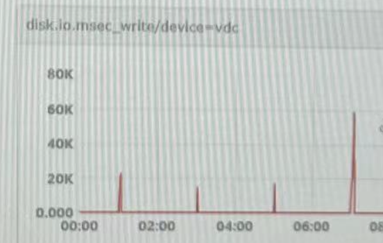

# etcd leader 频繁切换


## etcd leader 频繁切换

### 背景说明

管控服务依赖 etcd 进行选主，项目测试开发阶段均正常。项目交互后在客户环境部署，etcd 偶发性出现 leader 切换，但频率很低，几天出现一次。项目用量上升后开发频繁出现 leader 切换。

etcd 集群节点分别部署在三台虚拟机中，磁盘使用 Ceph 共享存储。每台虚拟机 IOPS 已设置为最大 1000。

### 问题排查

#### 管控服务（etcd 客户端）日志

- 异常日志1

```Text
rpc error: code = Unavailable desc = etcdserver: leader changed
```

- 异常日志2

```Text
rpc error: code = Unknown desc = context deadline exceeded
```

从客户端服务日志可知，由于 etcd leader 切换，导致服务异常。

#### etcd 日志

- 异常日志1

```Text
waiting for ReadIndex response took too long
```

- 异常日志2

```Text
{"level":"warn","msg":"slow fdatasync","took":"2.14025047s","expected-duration":"1s"}
```

- 异常日志3

```Text
raft.node: 255a2e4092d561fb changed leader from 255a2e4092d561fb to 1de1eaa8fb268f49 at term 3112
```

从 etcd 日志可以确认，由于 slow fdatasync，导致 etcd leader 切换。

#### 查看虚拟机监控

etcd leader 异常切换期间，虚拟机 CPU、内存使用率均在正常范围内。并且 IOPS、吞吐量、await延时等监控也均在有效范围内，所以暂时无法确定是否与 Ceph 共享存储性能问题。

但磁盘监控中存在一个异常指标，disk.io.msec_write（所有写入操作所花费的总时间）：



从监控看该指标最高达到60s，且每次峰值均能与 etcd `slow fdatasync` 日志时间吻合，可确认 etcd 频繁 leader changed 与磁盘性能有关。

### 问题确认

etcd leader 每 100ms 向 follower 发送心跳，维持 leader 地位。由于磁盘性能不足，导致 etcd fdatasync 较慢，超过 etcd follower 选举超时时间（election timeout，默认 1000ms，约10个心跳间隔），从而 etcd 其他 follower 节点开始新一轮 leader 选举，这就是 etcd 服务日志中看到的频繁 Leader changed 的原因。

从 disk.io.msec_write 监控图可以看出，峰值之间间隔约 2 小时，即每两小时出现一次 msec_write 升高，且 etcd 服务日志中出现一次 leader changed。查看服务部署拓扑图，发现三台 etcd 节点上分别都部署了 Prometheus 服务。

了解 Prometheus 存储原理的应该知道，Prometheus 新写入的数据保存在内存 block 中，2 小时后将 block 数据写入磁盘。同时，为了防止程序崩溃导致数据丢失，实现了 WAL（write-ahead-log）机制，服务启动时会以写入日志（WAL）的方式来实现重播，从而恢复数据。

为验证猜想，将虚拟机上 Prometheus 服务停掉后，etcd 服务运行正常，没有再出现 leader changed。

项目上线早期，业务量小，Prometheus 监控数据也比较小，所以偶发性出现 etcd leader changed。业务量上涨后，Prometheus 监控数据上涨，导致每 2 小时数据写入磁盘时，占用大量磁盘IO性能，影响 etcd 性能。

### 解决方案

知道了问题，解决方案就比较明了了，直接将 etcd 单独部署，不与其他业务耦合，减少相互之间的影响。

### 知识点扫盲

#### etcd fdatasync

fdatasync 与 fsync 都是系统调用，用于将块缓冲区数据写入磁盘。fsync 会等待写磁盘操作结束，然后同步返回，操作完成前会阻塞。可用于数据库这样的应用程序，这种应用程序需要确保将修改过的块立即写到磁盘上。fsync 会将文件的所有元数据（如文件的大小、权限、访问时间等）和文件内容一起同步到磁盘。而 fdatasync 仅同步文件内容及其与文件大小相关的元数据，而不处理不必要的元数据（如访问时间等）。因此，fdatasync 的开销通常比 fsync 更小，性能更好。

每当客户端添加或更新键值对数据时，etcd 会向 WAL 文件添加一条入库记录条目。再进一步处理之前，etcd 必须 100% 确保 WAL 条目已经被持久化。 要在 Linux 实现这一点，仅使用write系统调用是不够的，因为对物理存储的写入操作可能会发生延迟。比如，Linux 可能会将写入的 WAL 条目在内核内存缓存中保留一段时间（例如，页缓存）。如果要确保数据被写入持久化存储，你必须在 write 系统调用之后调用 fdatasync 系统调用。

#### ectd 实践推荐

由于 etcd 将数据写入磁盘并将提案保留在磁盘上，因此其性能取决于磁盘性能。尽管 etcd 不是特别 I/O 密集型的，但它需要低延迟块设备才能获得最佳性能和稳定性。由于 etcd 的共识协议依赖于将元数据持久存储到日志 (WAL)，因此 etcd 对**磁盘写入延迟很敏感**。**慢速磁盘和其他进程的磁盘活动**可能会导致较长的 fsync 延迟。

这些延迟可能会导致 etcd 错过心跳，无法及时将新提案提交到磁盘，并最终导致请求超时和暂时失去领导者。同样导致 etcd 心跳时间超过选举超时时间，从而破坏集群的领导者选举。基于这些原因，**应避免将对 I/O 敏感或密集且共享相同底层 I/O 基础架构的控制平面节点上的其他工作负载共置在一起**。

就延迟而言，在块设备上运行 etcd，该设备可以连续写入至少 50 IOPS，长度为 8000 字节。也就是说，延迟为 10 毫秒，请记住使用 fdatasync 同步 WAL 中的每个写入。对于负载较重的集群，建议连续 500 IOPS，长度为 8000 字节（2 毫秒）。要测量这些数字，可以使用基准测试工具，例如 fio。

为了实现这样的性能，应在具有**低延迟和高吞吐量的 SSD 或 NVMe 磁盘**支持的机器上运行 etcd。同样可以将 etcd 从共享磁盘移动到单独的磁盘，以防止或解决性能问题。

#### etcd 性能影响因素

etcd 提供稳定、持续的高性能。两个因素决定了性能：**延迟和吞吐量**。延迟是完成操作所需的时间。吞吐量是某个时间段内完成的总操作数。通常，当 etcd 接受并发客户端请求时，平均延迟会随着总体吞吐量的增加而增加。

etcd 使用 Raft 共识算法在成员之间复制请求并达成一致。共识性能（尤其是提交延迟）受到两个物理约束的限制：**网络 IO 延迟和磁盘 IO 延迟**。完成 etcd 请求的最短时间是成员之间的网络往返时间 (RTT) 加上 fdatasync 将数据提交到永久存储所需的时间。数据中心内的 RTT 可能长达几百微秒。美国境内的典型 RTT 约为 50 毫秒，而各大洲之间的 RTT 可能最慢为 400 毫秒。旋转磁盘的典型 fdatasync 延迟约为 10 毫秒。对于 SSD，延迟通常低于 1 毫秒。为了提高吞吐量，etcd 将多个请求批量处理并将它们提交给 Raft。这种批处理策略使 etcd 即使在负载很重的情况下也能实现高吞吐量。

还有其他子系统会影响 etcd 的整体性能。每个序列化的 etcd 请求都必须通过 etcd 的 boltdb 支持的 MVCC 存储引擎，这通常需要几十微秒才能完成。etcd 会定期增量快照其最近应用的请求，并将它们与之前的磁盘快照合并。此过程可能会导致延迟峰值。虽然这在 SSD 上通常不是问题，但它可能会使 HDD 上观察到的延迟加倍。同样，压缩也会影响 etcd 的性能。

