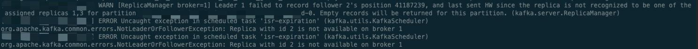
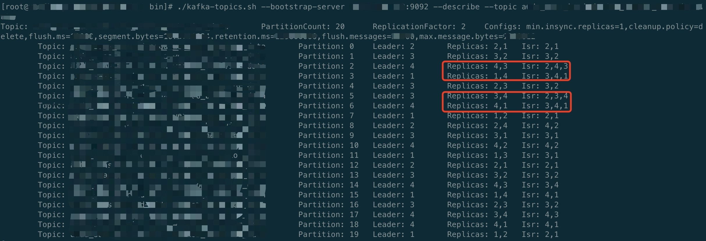
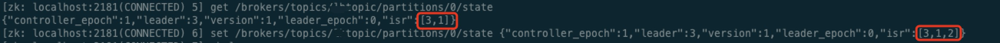

# Topic partition ISR 混乱，为 AR 超集


## Topic 分区 ISR 混乱，为 AR 超集

### 背景说明

有一个四节点的 Kafka 集群，Broker id 分别为 1、2、3、4。修改集群配置后滚动重启各节点，重启完成后，生产者写入消息失败。

### 问题排查

#### 查看 Broker 日志

```Text
Uncaught exception in scheduled task 'isr-expiration'
org.apache.kafka.common.errors.NotLeaderOrFollowerException: Replica with id 2 is not available on broker 1
```



该错误信息与官方 issue [KAFKA-9672](https://issues.apache.org/jira/browse/KAFKA-9672) 类似，均是由于 Broker 节点异常下线导致。

#### 查看 Topic 详情

此时出现部分 Topic 分区 ISR 混乱情况，即 ISR 副本集与 AR 副本集不一致，现象显示 ISR 为 AR 超集，与实际情况相悖。如图所示：



### 解决方案

1. 直接修改 ZooKeeper 中 Topic 分区 ISR 信息，如图：

    

    ```bash
    # 获取指定 topic 状态信息
    get /brokers/topics/testtopic/partitions/0/state
    # 手动修改 topic isr 信息
    set /brokers/topics/testtopic/partitions/0/state {"controller_epoch":1,"leader":3,"version":1,"leader_epoch":0,"isr":[3,1,2]}
    ```

2. 修改完成后，需删除 zk 上 /controller 节点，重新选举 Controller，用于更新 Kafka 集群控制器内存数据

    ```bash
    delete /controller
    ```

