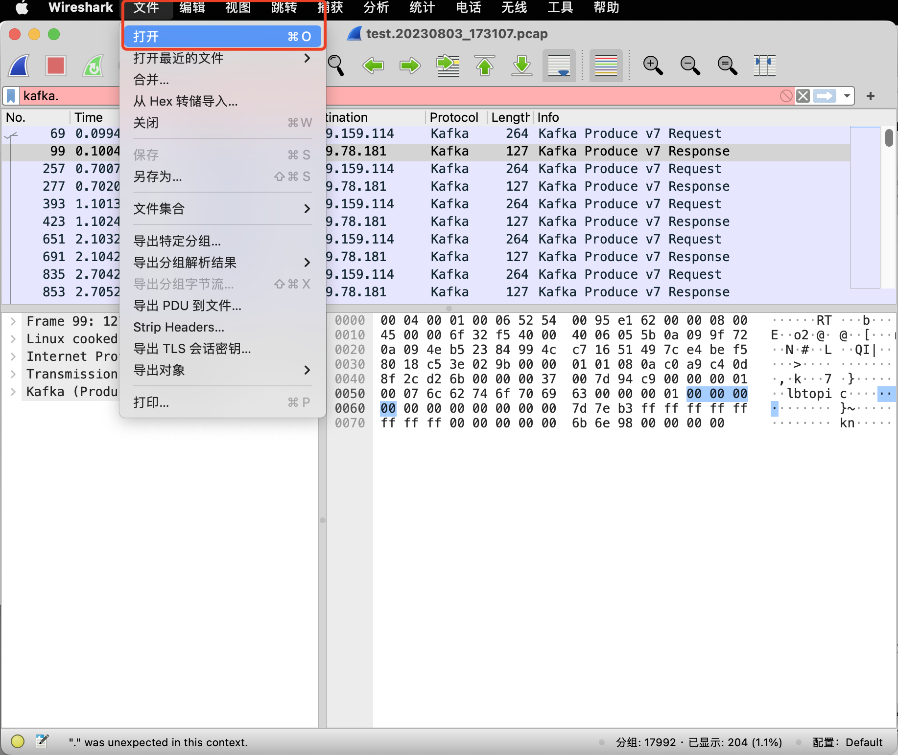

# Tcpdump + Wireshark 分析 Kafka 数据包


## 使用 Tcpdump + Wireshark 抓包获取 Kafka 指定 Topic 生产者连接 IP

### 背景

有一个 Kafka 集群，公司各业务共同使用。但由于公司架构调整，人员变动，导致部分 Topic 使用方信息缺失，需要进行梳理。

开源 Kafka 不支持查询指定 Topic 对应的生产者连接 IP，但能通过 `kafka-consumer-groups.sh` 脚本获取消费者连接 IP。于是需要通过抓包分析数据，获取指定 Topic 生产者连接 IP。

### 环境准备

* Kafka 集群节点上安装 Tcpdump
* 本机安装 Wireshark

### Tcpdump 抓包

1. 确认 Topic 副本分区分布，如无特殊使用场景（例如指定分区生产等），则可任选一个分区节点抓包
2. 登录 Kafka 集群节点，执行抓包命令

    ```bash
    # port 9092: Kafka 进程端口
    # -i any: 网卡名称，any 表示所有网卡
    # -s 0: 抓取数据包时默认抓取长度为68字节，加上 -s 0 后可以抓到完整的数据包
    # -w ukafka-rzvtagn5-kafka1.%Y%m%d_%H%M%S.pcap: 将包写入文件中，使用时间格式命名文件
    # -G 60: 每分钟切割一次文件，避免单个文件太大 
    # -Z root: 指定运行 tcpdump 进程的用户权限为 root
    tcpdump port 9092 -i any -s 0 -w test.%Y%m%d_%H%M%S.pcap -G 60 -Z root
    ```

3. 将数据包文件传输到本地

### Wireshark 分析

#### 前提

1. 确认 Wireshark 是否支持 Kafka 协议，如不支持，建议升级 Wireshark 版本

    > Wireshark 支持 Kafka 协议说明：[https://www.wireshark.org/docs/dfref/k/kafka.html](https://www.wireshark.org/docs/dfref/k/kafka.html)

    

2. 了解 Kafka 协议标准：[https://kafka.apache.org/0101/protocol.html](https://kafka.apache.org/0101/protocol.html)

#### 使用 Wireshark

1. 加载数据包文件

    

2. 填写过滤表达式，获取指定数据包

    ```bash
    # kafka.topic_name == lbtopic 过滤 Topic 名称为 lbtopic
    # kafka.api_key == 0 过滤 Kafka API key 为 0（0为生产）
    kafka.topic_name == lbtopic and kafka.api_key == 0
    ```

    > kafka.api_key 参考 Kafka 协议标准 [Api Keys](https://kafka.apache.org/0101/protocol.html#protocol_api_keys) 说明

    

    从中可以得知如下信息：

    * 生产端IP
    * 网络协议
    * 请求类型
    * 客户端端口

    

    同时，可以查看 Kafka 数据包具体信息。

3. 统计客户端所有 IP 地址

    打开统计页面：`统计 -> IPv4 Statistics -> All Addresses`

    

    填写过滤规则，获取客户端IP（注意去掉本机IP）：

    

    最终可确认生产者IP地址为： `10.9.78.181`

